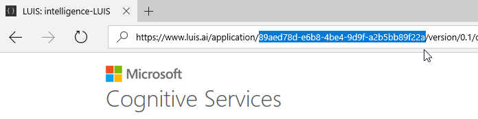

# Alt.Net Bot Sample

Three sample bots using Dialog and LuisDialog to integrate with a LUIS.ai application.

### Prerequisites

The minimum prerequisites to run this sample are:
* The latest update of Visual Studio 2017. You can download the community version [here](http://www.visualstudio.com) for free.
* The Bot Framework Emulator. To install the Bot Framework Emulator, download it from [here](https://emulator.botframework.com/). Please refer to [this documentation article](https://github.com/microsoft/botframework-emulator/wiki/Getting-Started) to know more about the Bot Framework Emulator.

#### LUIS Application
If you want to test this sample, you have to import the pre-build [Meetup.json](Meetup.json) file to your LUIS account.

The first step to using LUIS is to create or import an application. Go to the home page, www.luis.ai, and log in. After creating your LUIS account you'll be able to Import an Existing Application where can you can select a local copy of the Meetup.json file an import it.


Once you imported the application you'll need to "train" the model ([Training](https://www.microsoft.com/cognitive-services/en-us/LUIS-api/documentation/Train-Test)) before you can "Publish" the model in an HTTP endpoint. For more information, take a look at [Publishing a Model](https://www.microsoft.com/cognitive-services/en-us/LUIS-api/documentation/PublishApp).

Finally, edit the [LuisDialog.cs](Alt.NetBot/Dialogs/LuisDialog.cs#L11) file and update the LuisModel attribute placeholders with the values corresponding to your Subscription and Application.


````C#
    ...
    using Microsoft.Bot.Builder.Luis.Models;
    using Microsoft.Bot.Connector;

    [LuisModel("YourModelId", "YourSubscriptionKey")]
    public class LuisDialog : LuisDialog<object>
    {
    ...
````

#### Where to find the Application ID and Subscription Key

You'll need these two values to configure the LuisDialog through the LuisModel attribute:

1. Application ID

    In the LUIS application's dashboard, you can copy the App ID from the address bar.
    
    
    
2. Subscription Key

    In the [My keys page](https://www.luis.ai/home/keys), copy the Programmatic API Key.
    
    
    
### Meetup API Key

Navigate to https://secure.meetup.com/en-AU/meetup_api/key/ and discover your API key by clicking on the lock.


After coping the key, paste it on [Web.config](Alt.NetBot/Web.config#L13) key *MeetupApiKey*.